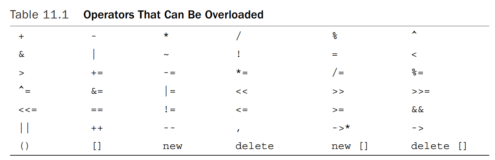

# Chapter 11 类的使用方法

- [Chapter 11 类的使用方法](#chapter-11-类的使用方法)
  - [11.1 运算符重载](#111-运算符重载)
    - [11.1.1 重载的用法](#1111-重载的用法)
    - [11.1.2 重载的限制（规则）](#1112-重载的限制规则)
  - [11.1.3 更多使用方法](#1113-更多使用方法)
  - [11.3 友元](#113-友元)
    - [11.3.1 创建友元](#1131-创建友元)
    - [11.3.2 常用的友元：重载\<\<运算符](#1132-常用的友元重载运算符)
  - [11.4 重载运算符：作为成员函数还是非成员函数](#114-重载运算符作为成员函数还是非成员函数)
  - [11.5 类的自动转换和强制类型转换](#115-类的自动转换和强制类型转换)
    - [11.5.1 使用类的构造函数进行类型转换](#1151-使用类的构造函数进行类型转换)
    - [11.5.2 类型转换函数](#1152-类型转换函数)
      - [创建类型转换函数](#创建类型转换函数)
      - [自动应用（隐式）类型转换](#自动应用隐式类型转换)


## 11.1 运算符重载

### 11.1.1 重载的用法

运算符重载将重载的概念扩展到运算符上。C++根据操作数的数目和类型来决定采用哪种操作。

C++允许将运算符重载扩展到用户定义的类型，例如，允许使用+将两个对象相加。编译器将根据操作数的数目和类型决定使用哪种加法定义。重载运算符可使代码看起来更自然。

要重载运算符，需使用被称为运算符函数的特殊函数形式。运算符函数的格式如下：

```c++
operator[op](argument-list) //其中的[op]替换为重载的运算符
```

operator+()重载+运算符，operator*()重载*运算符。op必须是**有效的C++运算符**，不能虚构一个新的符号。例如，不能有operator@()这样的函数，因为C++中没有@运算符。
注意：operator函数将重载[]运算符，因为[]是数组索引运算符（是C++中有效的运算符）。

举个例子：假设有一个Salesperson类，并为它定义了一个operator+()成员函数，以重载+运算符，以便能够将两个Saleperson对象的销售额相加，则如果district2、sid和sara都是Salesperson类对象，便可以编写这样的等式：

```c++
district2 = sid + sara;
```

编译器发现操作数是Salesperson类对象后，就会使用相应的运算符函数替换上述运算符：

```c++
district2 = sid.operator+(sara);
```

该函数将隐式地使用sid（因为它调用了方法），而显式地使用sara对象（因为它被作为参数
传递），来计算总和，并返回这个值。也就是说，在运算符表示法中，**运算符左侧的对象是调用对象，运算符右边的对象是作为参数被传递的对象**。当然最重要的是，可以使用简便的+运算符表示法，而不必使用笨拙的函数表示法。

定义了operator+()（重载了+运算符）之后，编译器将根据操作数的类型来决定如何做（该调用什么类型的函数）：

```c++
int a, b, c;
Time A, B, C;
c = a + b; // use int addition
C = A + B; // use addition as defined for Time objects
```

注意：连续加法是可行的，因为编译器会这样进行调用：

```c++
t4 = t1 + t2 + t3; 
t4 = t1.operator+(t2 + t3);
t4 = t1.operator+(t2.operator+(t3));
```

### 11.1.2 重载的限制（规则）

1. 重载后的运算符必须至少有一个操作数是用户定义的类型，这将防止用户为标准类型重载运算符。
   - 例如，不能将减法运算符（−）重载为计算两个double值的和，而不是它们的差。虽然这种限制将对创造性有所影响，但可以确保程序正常运行。
2. 使用运算符时不能违反运算符原来的句法规则。
   - 例如，不能将求模运算符（%）重载成使用一个操作数
3. 不能修改运算符的优先级。
   - 例如，如果将加号运算符重载成将两个类相加，则新的运算符与原来的加号具有相同的优先级。
4. 不能创建新运算符。
   - 例如，不能定义operator **( )函数来表示求幂。
5. 不能重载下面的运算符（详情见下面表格）

**表格：不能重载的运算符**
|运算符|含义|
| ----------- | ----------- |
| `sizeof` | sizeof运算符|
|`.` | 成员运算符|
|`.*` |成员指针运算符|
|`::`|作用域解析运算符|
|`?:`|条件运算符|
|`typeid`|一个RTTI运算符|
|`const_cast`|强制类型转换运算符|
|`dynamic_cast`|强制类型转换运算符|
|`reinterpret_cast`|强制类型转换运算符|
|`static_cast`|强制类型转换运算符|



5．表11.1中的大多数运算符都可以通过成员或非成员函数进行重载，但下面的运算符只能通过成员函数进行重载。

**表格：只能通过成员函数重载的运算符**
|Operator| Description|
|-----|-------|
|`=` |Assignment operator|
|`()` |Function call operator|
|`[]` |Subscripting operator|
|`->` |Class member access by pointer operator|

6. 除了以上的规则限制之外，还要注意重载运算符时最好符合运算符本身的含义，**千万不要把运算符重载成意义不明的操作**，因为你使用运算符时是不会有任何提示你它实际做的操作的代码的（不像函数调用时还有函数名提示你）。
   - 例如，不要将*运算符重载成交换两个对象的数据成员。
   - 如果你要做的操作和所有能重载的运算符的含义都不相符，那最好把它定义成一个普通的类成员函数吧。

## 11.1.3 更多使用方法

除了前面介绍的将`+`运算符重载成两个象相加的方法，你当然也可以重载`*`,`-`等等符号，运算符前后的操作对象的类型也可以是不同的，例如下面这样。

```c++
Time operator-(const Time & t) const;
Time operator*(double n) const;
```

当然，仍然遵循**运算符左侧的对象是调用对象，运算符右边的对象是作为参数被传递的对象**这一原则。

## 11.3 友元

众所周知，C++控制对类私有成员的访问。通常来说，唯一从外部访问类成员的方法是将其声明为公有成员。


但是有时候这种限制太过严格了。于是，C++提供了另外一种形式的访问权限：友元。

友元有3种：
- 友元函数
- 友元类
- 友元成员函数

当你重载了运算符*后，你可以以如下方式调用这个函数：

```c++
A = B * 2.75;
```

这样一来，相当于调用了这个函数：

```c++
A = B.operator*(2.75);
```

但如果想用下面这种方式去调用运算符重载的函数呢？

```c++
A = 2.75 * B; // cannot correspond to a member function
```

当然你可以告知用户只能以第一种方式使用这个类，但这显然很不优雅。所以，有另一种解决方案：非成员函数（大多数运算符都可以通过成员或非成员函数来重载）。非成员函数不是由对象调用的，它使用的所有值（包括对象）都是显式参数。这样，编译器能够将第二个表达式与如下的函数匹配：

```c++
A = operator*(2.75, B);
```

该函数的原型是：

```c++
Time operator*(double m, const Time & t);
```

使用非成员函数可以按所需的顺序获得操作数（先是double，然后是Time），但引发了一个新问题：非成员函数不能直接访问类的私有数据，至少常规非成员函数不能访问。于是，就有了一类特殊的非成员函数**可以访问类的私有成员**，它们被称为**友元函数**。

### 11.3.1 创建友元

1. 提供函数原型：将其原型**放在类声明中**，并在原型声明前加上**关键字friend**：

```c++
friend Time operator*(double m, const Time & t); // goes in class declaration
```

注意：
- 虽然operator *( )函数是在类声明中声明的，但它**不是成员函数**，因此**不能使用成员运算符来调用**
- 虽然operator *( )函数不是成员函数，但**它与成员函数的访问权限相同**。

2. 编写函数定义：因为它不是成员函数，所以不要使用Time::限定符。另外，不要在定义中使用关键字friend。定义应该如下：

```c++
Time operator*(double m, const Time & t) // friend not used in definition
{
    Time result;
    long totalminutes = t.hours * mult * 60 +t. minutes * mult;
    result.hours = totalminutes / 60;
    result.minutes = totalminutes % 60;
    return result;
}
```

这样一来，就能使用下面这种方式来调用了：

```c++
A = 2.75 * B
```

### 11.3.2 常用的友元：重载<<运算符

一个很有用的类特性是，可以对<<运算符进行重载，使之能与cout一起来显示对象的内容。

假设trip是一个Time对象，我们希望能像下面这样进行输出：

```c++
cout << trip;
```

首先，需要理解cout的一个特性：

```c++
cout << x << y;
\\equals to
(cout << x) << y;
```

正如iosream中定义的那样，<<运算符要求左边是一个ostream对象。显然，因为cout是ostream对象，所以表达式cout << x满足这种要求。然而，因为表达式cout << x位于<< y的左侧，所以输出语句也要求该表达式是一个ostream类型的对象。ostream类将operator<<( )函数实现为返回一个指向ostream对象的引用。具体地说，它返回一个指向调用对象（这里是cout）的引用。因此，表达式(cout << x)本身就是ostream对象cout，从而可以位于<<运算符的左侧。

这样一来，我们设计友元函数时也可以采用相同的方法。只要修改operator<<( )函数，让它返回ostream对象的引用即可。

```c++
ostream & operator<<(ostream & os, const Time & t)
{
    os << t.hours << " hours, " << t.minutes << " minutes";
    return os;
}
```

有趣的是，这个operator<<( )版本还可用于将输出写入到文件中：

```c++
fout << trip;
\\ equals to
operator<<(fout, trip);
```

事实上，是C++的**类继承**属性让ostream引用能够指向ostream对象和ofstream对象。

如果代码很短，也可以把友元函数定义为内联函数，直接在类声明中提供函数定义就会把友元函数定义为内联函数了。

## 11.4 重载运算符：作为成员函数还是非成员函数

对于很多运算符来说，可以选择使用成员函数或非成员函数来实现运算符重载。一般来说，非成员函数应是友元函数，这样它才能直接访问类的私有数据。

```c++
Time operator+(const Time & t) const; // member version
friend Time operator+(const Time & t1, const Time & t2); // nonmember version
```

加法运算符需要两个操作数。对于成员函数版本来说，一个操作数通过this指针隐式地传递，另一个操作数作为函数参数显式地传递；对于友元版本来说，两个操作数都作为参数来传递。

这两个原型都与表达式T2 + T3匹配，其中T2和T3都是Time类型对象。也就是说，这两种情况下，编译器将分别这样转换下面的语句：

```c++
T1 = T2 + T3;
// is translated to either of the following
T1 = T2.operator+(T3); // member function
T1 = operator+(T2, T3); // nonmember function
```

**需要注意的是**，在定义运算符时，必须选择其中的一种格式，而**不能同时选择这两种格式**。因为这两种格式都与同一个表达式匹配，**同时定义这两种格式将被视为二义性错误**，导致编译错误。

对于某些运算符来说（如前所述），成员函数是唯一合法的选择。在其他情况下，这两种格式没有太大的区别。有时，根据类设计，使用非成员函数版本可能更好（尤其是为类定义类型转换时）。

## 11.5 类的自动转换和强制类型转换

先看看C++对于内部类型的转换是如何处理的。首先，有自动类型转换：将一个标准类型变量的值赋给另一种标准类型的变量时，如果这两种类型兼容，则C++自动将这个值转换为接收变量的类型，例如：

```c++
long count = 8; // int value 8 converted to type long
double time = 11; // int value 11 converted to type double
int side = 3.33; // double value 3.33 converted to type int 3
```

这样做是可行的，因为在C++看来，各种数值类型都表示相同的东西——一个数字，同时C++包含用于进行转换的内置规则。当然，需要注意这样做可能会降低进度或者导致变量溢出。

C++语言不自动转换不兼容的类型。例如，下面的语句是非法的，因为左边是指针类型，而右边是数字：

```c++
int * p = 10; // type clash
```

然而，在无法自动转换时，可以使用强制类型转换：

```c++
int * p = (int *) 10; // ok, p and (int *) 10 both pointer
```

上述语句将10强制转换为int指针类型（即int *类型），将指针设置为地址10。当然这种赋值没啥意义。

对于自行设计的类来说，可以将类定义成与基本类型或另一个类相关，使得从一种类型转换为另一种类型是有意义的。在这种情况下，程序员可以指示C++如何自动进行转换，或通过强制类型转换来完成。

### 11.5.1 使用类的构造函数进行类型转换

举一个例子来说明如何在C++中让自定义的类支持从内置类型到该类型的转换：

```c++
// stonewt.h -- definition for the Stonewt class
#ifndef STONEWT_H_
#define STONEWT_H_
class Stonewt
{
private:
    enum {Lbs_per_stn = 14}; // pounds per stone
    int stone; // whole stones
    double pds_left; // fractional pounds
    double pounds; // entire weight in pounds
public:
    Stonewt(double lbs); // constructor for double pounds
    Stonewt(int stn, double lbs); // constructor for stone, lbs
    Stonewt(); // default constructor
    ~Stonewt();
    void show_lbs() const; // show weight in pounds format
    void show_stn() const; // show weight in stone format
};
#endif
```

Stonewt对象表示一个重量，所以可以提供一些将整数或浮点值转换为Stonewt对象的方法。我们其实已经通过提供相应的构造函数来提供这些转换的方法。在C++中，接受一个参数的构造函数为将类型与该参数相同的值转换为类提供了蓝图。因此，下面的构造函数用于将double类型的值转换为Stonewt类型：

```c++
Stonewt(double lbs); // template for double-to-Stonewt conversion
```

所以，你可以这样写代码：

```c++
Stonewt myCat; // create a Stonewt object
myCat = 19.6; // use Stonewt(double) to convert 19.6 to Stonewt
```

只有接受一个参数的构造函数才能作为转换函数。下面的构造函数有两个参数，因此不能用来转换类型：

```c++
Stonewt(int stn, double lbs); // not a conversion function
```

但是，如果给第二个参数提供默认值，它就可用于转换int：

```c++
Stonewt(int stn, double lbs = 0); // int-to-Stonewt conversion
```


当然，程序员不希望出现意外的类型转换，所以C++新增了关键字explicit，用于关闭这种自动类型转换的特性。（只允许显式类型转换）

```c++
explicit Stonewt(double lbs); // no implicit conversions allowed
```

这将关闭隐式类型转换，但仍然允许显式转换，即显式强制类型转换，如以下例子中的最后两行代码所示

```c++
Stonewt myCat; // create a Stonewt object
myCat = 19.6; // not valid if Stonewt(double) is declared as explicit
mycat = Stonewt(19.6); // ok, an explicit conversion
mycat = (Stonewt) 19.6; // ok, old form for explicit typecast
```

**总结：只接受一个参数的构造函数定义了从参数类型到类类型的转换。如果使用关键字explicit限定了这种构造函数，则它只能用于显式转换，否则既可用于显式转换，也可以用于隐式转换。**

隐式类型转换会在以下几种情况下发生：
- 将Stonewt对象初始化为double值时。
- 将double值赋给Stonewt对象时。
- 将double值传递给接受Stonewt参数的函数时。
- 返回值被声明为Stonewt的函数试图返回double值时。
- 在上述任意一种情况下，使用可转换为double类型的内置类型时。

上面提及的最后一种情况使得C++允许使用Stonewt（double）构造函数来转换其他数值类型。也就是说，下面两条语句都首先将int转换为double，然后使用Stonewt（double）构造函数。

```c++
Stonewt Jumbo(7000); // uses Stonewt(double), converting int to double
Jumbo = 7300; // uses Stonewt(double), converting int to double
```

**当且仅当转换不存在二义性时，才会进行这种两步转换**。也就是说，如果这个类还定义了构造函数Stonewt（long），则编译器将拒绝这些语句，这是因为：int可被转换为long或double，因此调用存在二义性。

### 11.5.2 类型转换函数

前面一节介绍了如何将数字转换为Stonewt对象。但是我们可能有做相反的转换的需求，例如将Stonewt对象转换为double值。可以这样做，但不是使用构造函数。构造函数只用于从某种内置类型到类类型的转换。要进行相反的转换，必须使用特殊的C++运算符函数——**转换函数**。

转换函数是用户定义的强制类型转换，可以像使用强制类型转换那样使用它们。例如，如果定义了从Stonewt到double的转换函数，就可以使用下面的显式转换：

```c++
Stonewt wolfe(285.7);
double host = double (wolfe); // syntax #1
double thinker = (double) wolfe; // syntax #2
```

当然，也可以隐式类型转换：

```c++
Stonewt wells(20, 3);
double star = wells; // implicit use of conversion function
```

#### 创建类型转换函数

类型转换函数的原型如下：

```c++
operator typeName(); //typeName refers to a name of a type such as int, double or the class you define
//for example
operator int();
operator double();
```

注意：
- 转换函数必须是类方法；
- 转换函数不能指定返回类型；
- 转换函数不能有参数。

#### 自动应用（隐式）类型转换

```c++
#ifndef STONEWT1_H_
#define STONEWT1_H_
class Stonewt
{
private:
    enum {Lbs_per_stn = 14}; // pounds per stone
    int stone; // whole stones
    double pds_left; // fractional pounds
    double pounds; // entire weight in pounds
public:
    Stonewt(double lbs); // construct from double pounds
    Stonewt(int stn, double lbs); // construct from stone, lbs
    Stonewt(); // default constructor
    ~Stonewt();
    void show_lbs() const; // show weight in pounds format
    void show_stn() const; // show weight in stone format
    // conversion functions
    operator int() const;
    operator double() const;
};
#endif
```

```c++
Stonewt poppins(9,2.8); // 9 stone, 2.8 pounds
double p_wt = poppins; // implicit conversion
cout << "Convert to double => ";
cout << "Poppins: " << p_wt << " pounds.\n";
cout << "Convert to int => ";
cout << "Poppins: " << int (poppins) << " pounds.\n";
```

在这个例子中，`double p_wt = poppins`就使用了自动（隐式）类型转换。由于p_wt被定义为double类型，编译器会自动调用向double类型转换的转换函数。

举个例子，假设我们省略最后一条cout语句的显式强制类型转换，使用隐式转换：

```c++
cout << "Poppins: " << poppins << " pounds.\n";
long gone = poppins; // ambiguous
```

这时，编译器会报错，**不会**进行隐式类型转换，因为这里的类型转换存在**二义性**，Stonewt既有int类型的转换函数，也有double类型的转换函数，并且在这个cout示例中两者都可以使用。编译器不知道在此情况下不知道使用哪种类型转换，自然就会报错。

同样地，由于int和double值都可以被赋给long变量，所以上面第二条语句也具有**二义性**，因此也会报错。

- 当然，如果这个类只定义了int转换函数或者只定义了double转换函数，那么这两个语句都没有二义性了，也就不会报错。
- 另外，虽然使用隐式转换会报错，但你使用显式转换是不会有任何问题的，所以无论是从避免报错还是代码可读性角度来说，其实都应该尽可能使用显式转换。例如：

```c++
long gone = (double) poppins; // use double conversion
long gone = int (poppins); // use int conversion
```

与使用构造函数进行类型转换类似，在C++11标准中，转换函数也支持使用explicit关键字关闭自动（隐式）转换特性，从而使得强制相应类型转换只能被显式的使用，避免发生一些意外的类型转换。

```c++
class Stonewt
{
...
// conversion functions
    explicit operator int() const;
    explicit operator double() const;
};
```

注意，这个功能在C++98标准中是没有的。所以，如果你的代码不支持C++11或更新了标准，那么有两个选择：
- 别用类型转换函数了：用一个功能相同的非转换函数替换该转换函数即可，仅在被显式地调用时，该函数才会执行。
- 改写项目以支持C++11标准：C++11也不是什么很新的标准了，现在的项目早都应该支持了（
